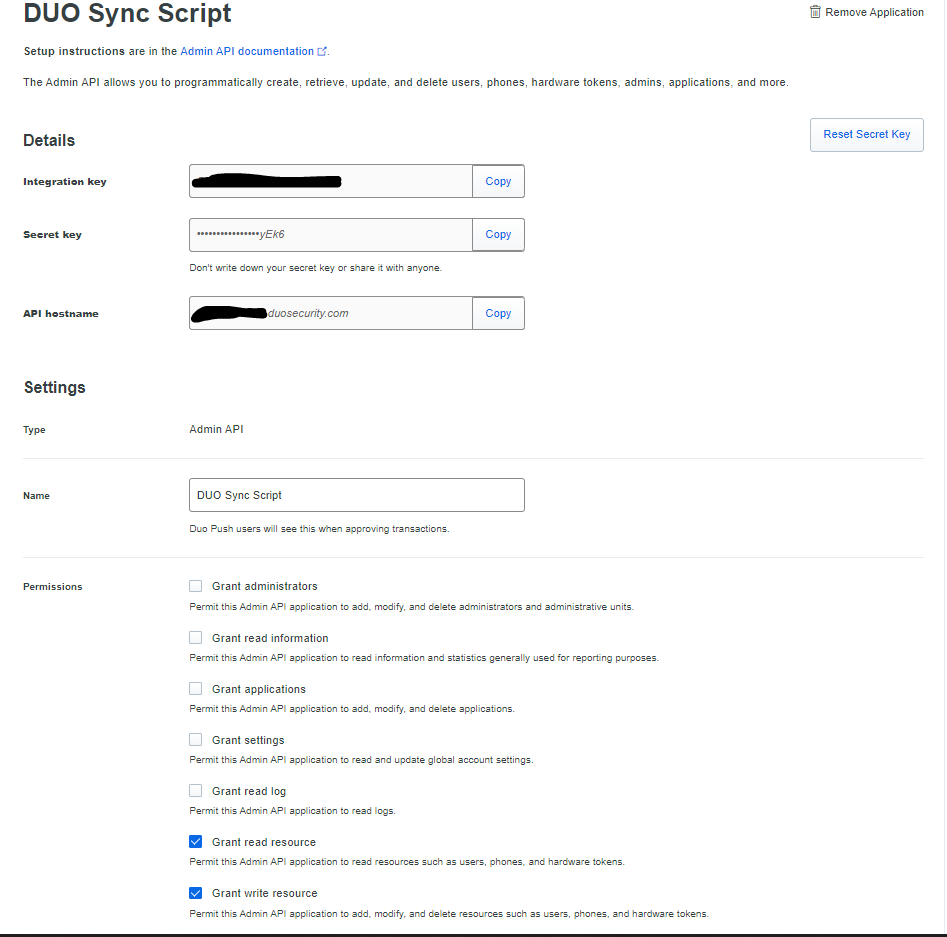
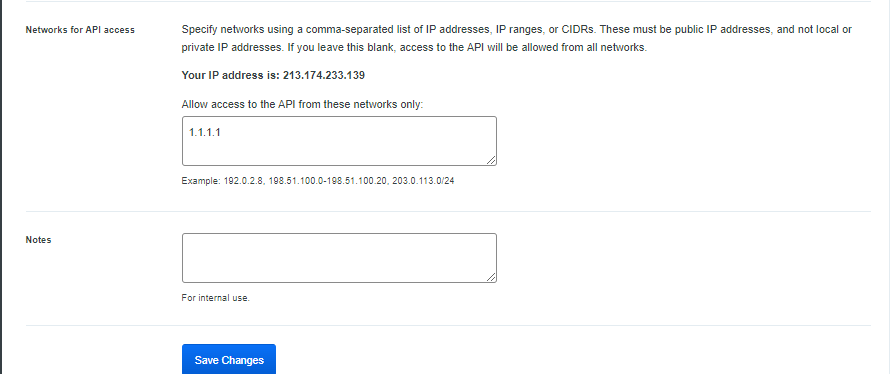

<div id="top"></div>

<!-- PROJECT LOGO -->
<br />
<div align="center">
  <a href="https://duo.com">
    
  </a>

  <h3 align="center">Cisco DUO User Sync Script</h3>

  <p align="center">
    · <a href="https://github.com/eizieizi/duo-usersync/issues">Report Bug</a>
    · <a href="https://github.com/eizieizi/duo-usersync/issues">Request Feature</a>
  </p>
</div>

<br/>
<br/>

<!-- TABLE OF CONTENTS -->
<details>
  <summary>Table of Contents</summary>
  <br/>
  <ol>
    <li>
      <a href="#about-the-project">About the DUO User Sync Script</a>
      <ul>
        <li><a href="#built-with">Built With</a></li>
      </ul>
    </li>
    <li>
      <a href="#getting-started">Getting Started</a>
      <ul>
        <li><a href="#prerequisites">Prerequisites</a></li>
        <li><a href="#installation">Installation</a></li>
      </ul>
    </li>
    <li><a href="#usage">Usage</a></li>
    <li><a href="#roadmap">Roadmap</a></li>
    <li><a href="#license">License</a></li>
    <li><a href="#contact">Contact</a></li>
  </ol>
</details>

<br/>
<br/>

## About the DUO User Sync Script

Cisco DUO allows to synchronize internal users from Active Directory into the own DUO Tenant to automatically enroll users with multi factor authentication. DUO uses its own Software called "DUO Authentication Proxy" for this. 

Unfortunatley, when using the proxy, the synchronization interval between the local Active Directory and DUO is hardcoded to 24 hours and cannot be changed. The only solution is to trigger a manual sync in the Dashboard.

Unfortunatley, the DUO API does not allow to do a bulk synchronization of all users like it is possible in the directory config of the DUO GUI. 
It is necessary to download all users from DUO, compare with the local users in the AD synchronization group and trigger synchronization on a per-user basis. 

So this script is used in combination with the DUO Authentication Proxy. The Script triggers the synchronization of a user in the DUO API, which then triggers the synchronization of the User through the Authentication Proxy. 


<p align="right">(<a href="#top">back to top</a>)</p>


<!-- GETTING STARTED -->
## Getting Started
<br/>
To install the script, you simply have to download the repository to the Server where the DUO Authentication Proxy is installed. 

The script wil create a folder called "usersync" in the default path of the DUO Authentication Proxy

```powershell
C:\Program Files\Duo Security Authentication Proxy\usersync
```
Afterwards you have to start a powershell as administrator and switch to the downloaded script directory.
<br/>
<br/>
### Prerequisites

To allow the Script API Access, it is necessary to add the Admin API in the DUO Tenant. It is recommended, to create a new Application even when you already have a Admin API Application to further separate credentials and access rights. 

See the Screenshot for the necessary permissions:




<br/>

### Installation

The Script has to be installed with the following parameter. 

```powershell
./sync.ps1 -install
```

This will install the RSAT AD DS Tools and ask for necessary data to allow the script query the DUO API. 

The following data has is queried:

* Hostname of the DUO API tenant
* Admin API Integration Key
* Admin API Secret Key
* Directory Key of DUO
* Distinguished Name of local AD Group to Sync
* Username format in DUO (samAccountName or UserPrincipalName)
* Automatic Sync Interval value

The API Key, Integration Key and Directory Key are stored encrypted on the filesystem. The values are encrypted with a key which is also stored on the filesystem. It´s not possible to use SecureString because they are tied to a user account which prevents automatic sync as scheduled task. 

The script will install a scheduled task to allow automatic synchronization.
After the installation is finished, the script copied itself to the 

```powershell
C:\Program Files\Duo Security Authentication Proxy\usersync
```

 location. The downloaded folder where the installer was started can now be deleted. 

<p align="right">(<a href="#top">back to top</a>)</p>


<!-- USAGE EXAMPLES -->
### Usage

It´s also possible to manually trigger a sync.

```powershell
./sync.ps1 -ManualSync
```


<p align="right">(<a href="#top">back to top</a>)</p>


<!-- ROADMAP -->
### Roadmap

- [x] Add Readme
- [ ] Try the script in a bigger scope with more users to see if any problems occure (API rate limit, pagination, ...)
- [ ] Think about a solution to not run the scheduled task as NT AUTHORITY\SYSTEM
  


See the [open issues](https://github.com/eizieizi/duo-usersync/issues) for a full list of proposed features (and known issues).

<p align="right">(<a href="#top">back to top</a>)</p>


<!-- LICENSE -->
## License

Distributed under the MIT License. See `LICENSE.txt` for more information.

<p align="right">(<a href="#top">back to top</a>)</p>


<!-- CONTACT -->
## Contact

Max Eizenberger - max.eizenberger@nts.eu

<p align="right">(<a href="#top">back to top</a>)</p>